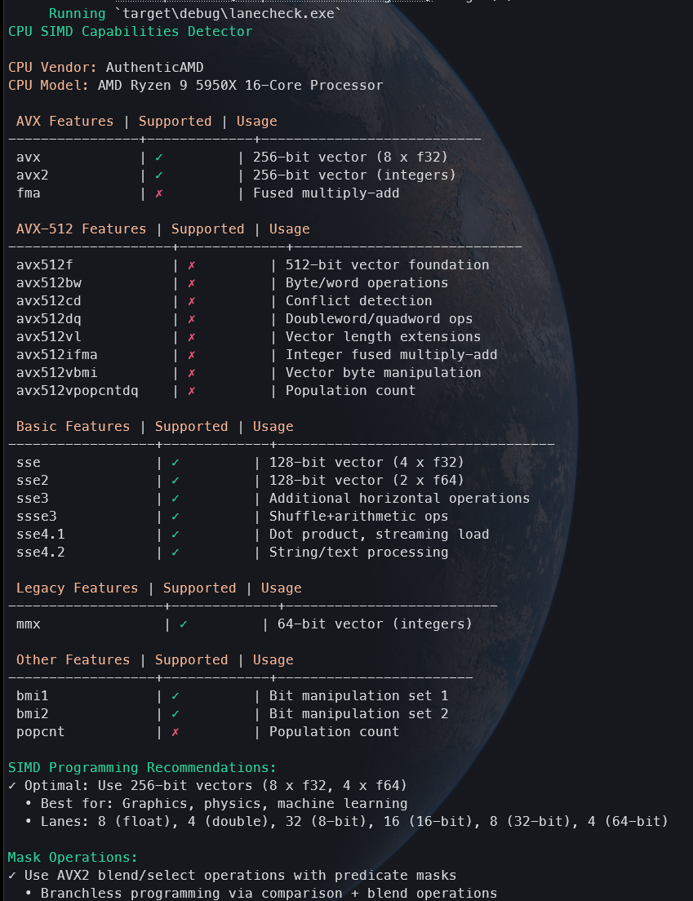

# Lanecheck

So, I've been doing a lot of SIMD lately and I like to know what is available on the misc machines that I develop on/for.

...And whilst the output of `cpuid` is _wonderful_, I wanted my own, **simpler** thing.

# Usage
`git clone https://github.com/alphastrata/lanecheck`

`cargo run -r`

or,

`cargo install --path .` or `cargo install --git https://github.com/alphastrata/lanecheck`

`lanecheck`

# Output:
